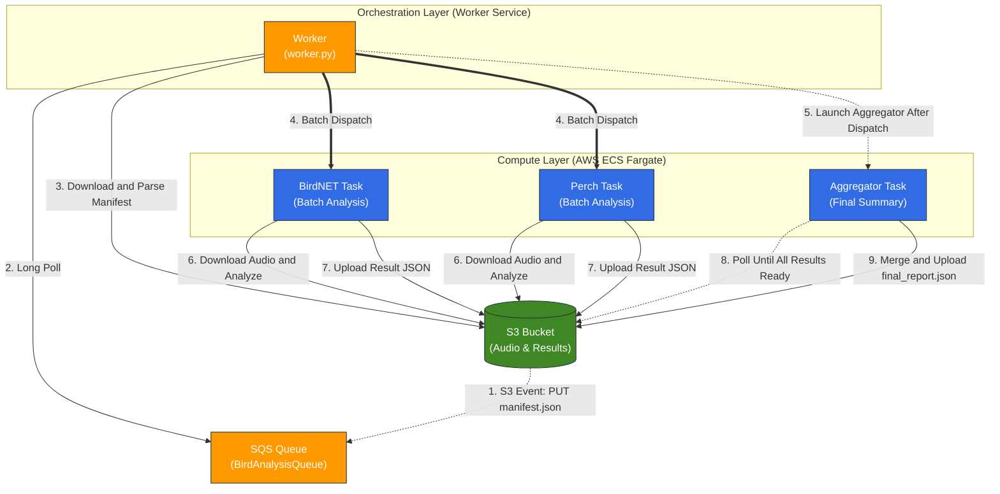

# 🐦 Bird Analysis Worker (Orchestrator)

The **Bird Analysis Worker** is a Python-based orchestration service that listens to an AWS SQS queue and automatically triggers large-scale audio analysis tasks on AWS Fargate whenever a `manifest.json` is uploaded.

It acts as the **Commander** of the entire Bird Species Detection & Analysis Pipeline.

---

## 📑 Table of Contents

- [Overview](#-overview)
- [Architecture](#-architecture)
- [Prerequisites](#-prerequisites)
- [Environment Variables](#%EF%B8%8F-environment-variables)
- [Local Development](#-local-development--testing)
- [Production Deployment](#-deployment-to-aws-production)
- [License](#-license)

---

## 📌 Overview

This service performs the following functions:

- **Long-polls** an SQS queue for notifications.
- **Detects** uploaded `manifest.json` files in S3.
- **Parses** the manifest to extract audio file lists.
- **Batches** thousands of files into chunks (default 50).
- **Dispatches** BirdNET and Perch analysis tasks to AWS Fargate.
- **Triggers** a final aggregator task to combine results.

---

## 🏗 Architecture

### System Flow (Mermaid Diagram)

